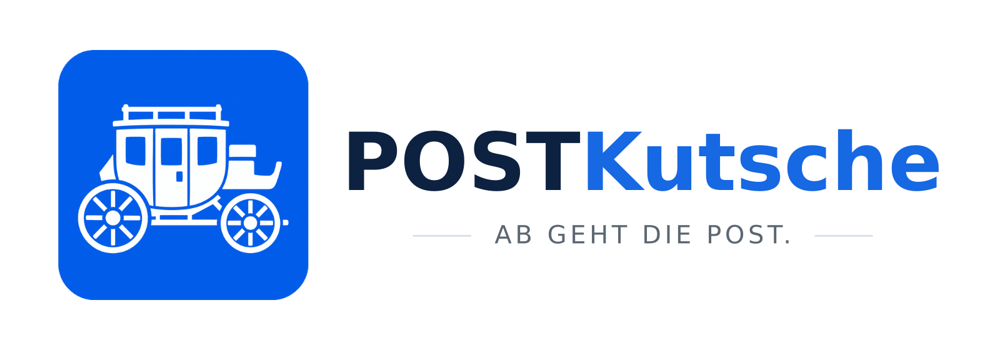

[Deutsch](README.md) | [English](README.en.md) | [Changelog](CHANGELOG.md) | [TODO](TODO.en.md)

<p align="center">
  <picture>
    <source media="(prefers-color-scheme: dark)" srcset="assets/banner-dark-1600.png">
    
  </picture>
</p>

# POSTKutsche

An editorial calendar for your own sites and your social accounts.

POSTKutsche checks your blogs and shops for what's new, has Claude write a
separate version for each network, shows them to you in a calendar as drafts —
and publishes them at the time you chose. For Facebook and Instagram, while
Meta's review is pending, it puts text and image ready for you to copy.

Developed on Arch Linux and Debian.

## What it does

**It finds the occasions itself.** WordPress via the REST API, shops via their
sitemap and category pages – Shopware 6 included, and without an access key.
A new blog post or product shows up in the calendar as a suggestion.

**It writes differently for each network.** A Mastodon post has 500 characters,
LinkedIn folds away everything after the first sentence, and on Instagram no
link in the text is clickable. Pasting the same announcement four times means
it doesn't fit three of them.

**It knows your readers.** Suggested times depend on network and audience — and
for the trades it follows the trades, not the guides: a roofer checks their
phone at half past six, not at ten.

**Nothing goes out unread.** Posts sit in the calendar as drafts until you
approve them. This can be turned off per project.

**It can repeat.** A post that did well in June can be scheduled again next
June. The old one keeps its date, the new one is a draft — so you can see what
already ran and reword it. You'll have to: Facebook and Instagram throttle
verbatim repeats.

## What it doesn't do

**No videos.** Turning images into short clips was the original plan and was
dropped on 2026-08-28. There are images, cropped to 4:5.

**No username-and-password login.** The networks don't allow it, and they're
right not to. It takes access tokens, and you create those yourself.

**No way around Meta's review.** Publishing to Facebook and Instagram
automatically requires an approved Meta app. Until then: by hand.

## Setup

```
git clone https://github.com/Stephan-Lefty/POSTKutsche.git
cd POSTKutsche
pip install -e .
postkutsche einrichten
```

The core runs without third-party packages. Two things are optional:

```
pip install -e ".[bilder]"      # crop images to 4:5 (Pillow)
pip install -e ".[schluessel]"  # tokens in the keyring instead of a file
pip install -e ".[alles]"       # both
```

## First steps

The command line speaks German — `einrichten` is "set up", `projekt` is
"project", `plan` is the calendar, `netzwerke` are the networks.

```
postkutsche einrichten              # create the database, add example projects
postkutsche projekt liste           # what's there
postkutsche netzwerke               # colours, character limits, quirks
postkutsche plan --monat 2026-09    # what's coming up
```

Projects can be added at any time:

```
postkutsche projekt neu meinblog "My blog" https://myblog.example --art wordpress
```

And paused without losing anything:

```
postkutsche projekt pausieren myblog   # stop fetching, stop sending
postkutsche projekt starten myblog     # carry on as before
```

Pausing and hiding are two different things: the checkbox in the calendar only
tidies the view, pausing stops the operation.

## Adding your own sites

The repository only contains examples under `.example`. Your own sites go into
`~/.config/postkutsche/projekte.json` — there and nowhere else. See the German
README for the format. That file and `hersteller.json` are in `.gitignore` and
a test watches over it.

## Where credentials live

In the keyring if `keyring` is installed. Otherwise in
`~/.config/postkutsche/zugaenge.json` with mode `600`. Not in the database, and
certainly not in the repository — a test watches over that.

| Network | Effort | What you need |
|---|---|---|
| Mastodon | two minutes | access token from your account settings |
| LinkedIn (own profile) | half an hour | your own app, "Share on LinkedIn", `w_member_social`. Token expires after 60 days and is refreshed. |
| Facebook page | weeks | Meta app with reviewed permissions |
| Instagram | weeks | same, plus a Business account (not Creator) linked to a Facebook page |

## Status

Early. See the [changelog](CHANGELOG.md) and the [TODO list](TODO.en.md).

## Licence

MIT. See [LICENSE](LICENSE).
