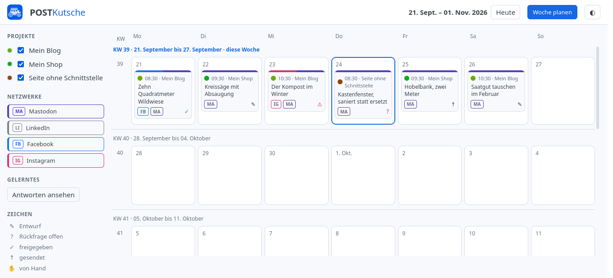
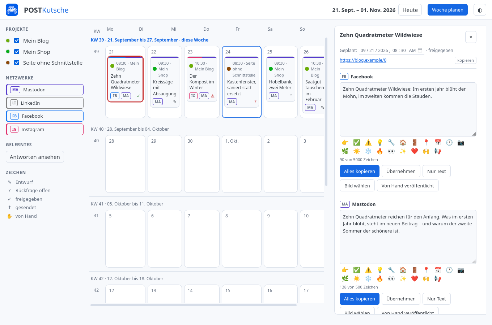
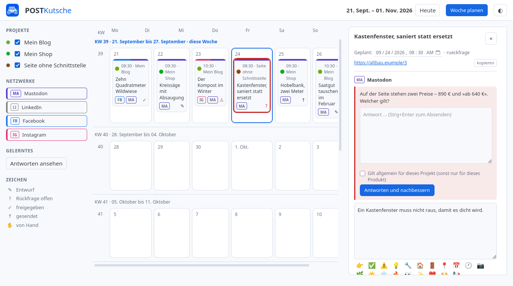
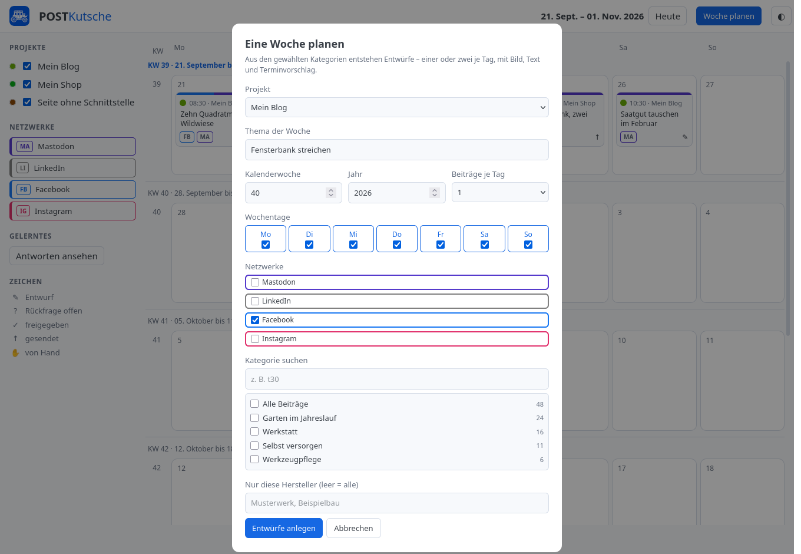
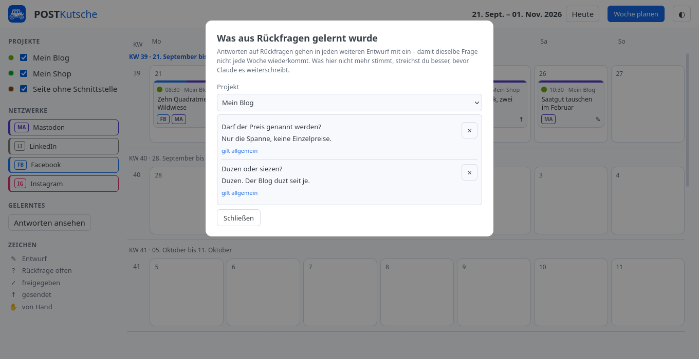

[Deutsch](bedienung.md) | [English](bedienung.en.md) | [Overview](../README.en.md) | [Installation](installation.en.md) | [Changelog](../CHANGELOG.md)

# Using POSTKutsche

How to work with POSTKutsche, from the calendar to the published post. How to
install it is in the [installation guide](installation.en.md).

Every screenshot on this page shows invented projects and invented texts.
They are regenerated with `python werkzeuge/anleitungsbilder.py` whenever the
interface changes. The interface itself is German only.

## Contents

- [The calendar](#the-calendar)
- [A post in detail](#a-post-in-detail)
- [Answering queries](#answering-queries)
- [Planning a week](#planning-a-week)
- [Reviewing what was learned](#reviewing-what-was-learned)
- [Publishing](#publishing)
- [When something is stuck](#when-something-is-stuck)

## The calendar



The calendar is the start page and runs in the browser at
`http://localhost:8770`. It shows a continuous strip of weeks: scrolling up
fetches past weeks, scrolling down future ones – loaded as you go, no paging.
**»Heute«** jumps back to the current week. The **◐** button on the right
switches between the light and the dark theme and remembers the choice.

Every planned post is a card in its project's colour, carrying the time, the
project name, the title, and at the bottom the network tags – **MA** for
Mastodon, **FB** for Facebook, **IG** for Instagram, **LI** for LinkedIn. A
post stays *one* card even when it goes to four networks; the versions live
inside it.

The bottom right of the card shows its state:

| Sign | Meaning |
|---|---|
| ✎ | draft – written, not reviewed yet |
| ? | query open – Claude could not decide something |
| ✓ | approved – may go out, hasn't yet |
| ↑ | sent |
| ✋ | published by hand |

**A card can be dragged to another day.** The time of day stays as it was,
only the date changes, and the new date is saved right away.

The left column lists the projects with checkboxes. The checkbox only tidies
the view and stops nothing – to actually put a project on hold, pause it
(`postkutsche projekt pausieren …`); paused projects are struck through and
carry a pause sign. **What is hidden stays hidden after a reload.** That's
remembered in the browser, so per machine and browser; a project added later
is visible.

The colour dot in front of a project name is a button: clicking it opens the
colour picker. The suggested colours keep their distance from the network
colours, so a project dot is never mistaken for a network tag.

## A post in detail



Clicking a card opens the post on the right. At the top are the date and the
state – the date is a field and can be changed there – and below it the link
to the source with a **»kopieren«** (copy) button.

Below that comes one block per network. It holds the text area, a row of
emoji to insert, the character count (»138 von 500 Zeichen«, red once it is
too much) and the buttons:

- **»Alles kopieren«** (copy everything) puts text, link and hashtags on the
  clipboard together – what you paste into Facebook or Instagram. For
  Instagram the link is not in the text; instead it says the link is in the
  profile, because links in Instagram posts do nothing.
- **»Nur Text«** (text only) copies the text field alone.
- **»Übernehmen«** (apply) saves what you changed in the field. The version
  then counts as *edited by hand* and is no longer silently overwritten by
  »rewrite« – that takes an explicit confirmation.
- **»Bild wählen«** (choose image) attaches an image, **»Zweites Bild«** a
  second one. Only the first goes out through the API; for both, the post has
  to be published by hand, and the interface says so.
- **»Von Hand veröffentlicht«** (published by hand) ticks off what you posted
  yourself.

Once everything is in order, **»Freigeben«** (approve) makes the post ready
to send. Approved means »may go out«, not »has gone out«: sending happens at
the scheduled time. As long as a post hasn't appeared it can also be deleted;
what is out stays.

## Answering queries



When Claude cannot decide something – two prices on the page, a contradictory
figure – it doesn't write down a guess, it asks. The question sits in a red
frame above the text, and the post cannot be approved while it is open.

You answer in the field below and press **»Antworten und nachbessern«**
(answer and revise), or Ctrl+Enter. Claude then rewrites the text using what
you said.

The switch **»Gilt allgemein für dieses Projekt«** (applies to this project
in general) is what matters:

- **Ticked**, the answer goes into the project's knowledge and is included in
  *every* further draft. Right for things like »we use informal address« or
  »prices only as a range«.
- **Unticked**, it only applies to this one product or post.

That distinction isn't decoration. Sending everything along wholesale feeds
Claude thirty special cases after six months and produces worse texts, not
better ones.

## Planning a week



**»Woche planen«** (plan a week) at the top right fills a whole week at once:
for each chosen day POSTKutsche picks something that hasn't run in a while,
has Claude write the versions, and puts the drafts into the calendar with a
suggested time.

Blogs and sites without an API can be planned. The fields:

| Field | What it does |
|---|---|
| **Projekt** | where the posts come from |
| **Thema der Woche** | the theme the week runs under |
| **Kalenderwoche**, **Jahr** | which week gets filled |
| **Beiträge je Tag** | one or two |
| **Wochentage** | which days are used |
| **Netzwerke** | which networks get versions |
| **Bereich** | rough preselection for large shops; hidden for blogs and small ones |
| **Kategorie suchen** | filters the list below |
| **Kategorien** | what to draw from, with the number of items actually plannable |
| **Nur diese Hersteller** | restricts to model ranges; empty means all |

The number behind a category is not always the number the site reports: on a
bilingual blog WordPress counts the other language too, and whatever ran in
the last four weeks is blocked anyway. What is shown is what can really be
planned – otherwise you plan seven days, get four drafts, and never learn
why.

After **»Entwürfe anlegen«** (create drafts) the run is visible: a bar and
»3 von 10 …« below it. The button next to it now reads **»Planung
abbrechen«** (cancel planning) and does exactly that – the run stops between
two posts and takes back what it has already created. Otherwise the items it
started would count as promoted for four weeks although nothing ever
appeared.

A second run is blocked while one is going. If one hangs, it releases itself
after ten minutes without a sign of life – a lock nobody can release would be
worse than two runs.

## Reviewing what was learned



**»Antworten ansehen«** (view answers) in the left column opens what has been
collected from your answers – per project, marked »applies in general« or
»this product only«. The × deletes an entry.

This view exists because the collection would otherwise be a one-way street.
After six months something in there is no longer true – a supplier changed, a
standard was replaced – and Claude keeps writing it into every post without
anyone finding the place.

## Publishing

There are two routes, and which one applies depends on the network.

**Through the API** goes Mastodon. An approved post is sent at its scheduled
time; the timer takes care of that, checking every five minutes (see
[installation](installation.en.md)). If the machine was off, the post goes
out on the next start – with a note about the delay, not silently.

**By hand** go Facebook and Instagram. Meta's app review takes weeks and
isn't worth it for a single purpose. The routine: **»Alles kopieren«**, fetch
the image with **»Unter Dokumente ablegen«** (file under Documents), post it
in the network, come back and press **»Von Hand veröffentlicht«**.

Filed images end up under
`~/Dokumente/POSTKutsche/<year>-KW<week>/<project>/`. They go there rather
than into the download folder because a browser cannot decide where a file
lands – the service runs on the same machine and files it itself. The week
comes first in the name so that months later you can tell what can go.

## When something is stuck

**A window won't close.** Escape closes »Woche planen« and »Gelerntes« even
when a run is hanging.

**The interface looks unchanged although something was changed.** The browser
is holding on to the old files: Ctrl+Shift+R once.

**A view reports an error that sounds like the API.** Files in the browser
take effect immediately, the Python part only after the service restarts:

```
systemctl --user restart postkutsche-kalender.service
```

**A post cannot be approved.** Then a query is still open – it sits in red in
the post.

**The category list stays empty or says »nicht erreichbar«.** Then the site
isn't answering right now. For shops without an API the structure is cached
for twelve hours; the first call in the morning therefore takes about twenty
seconds, after that the window opens immediately.
