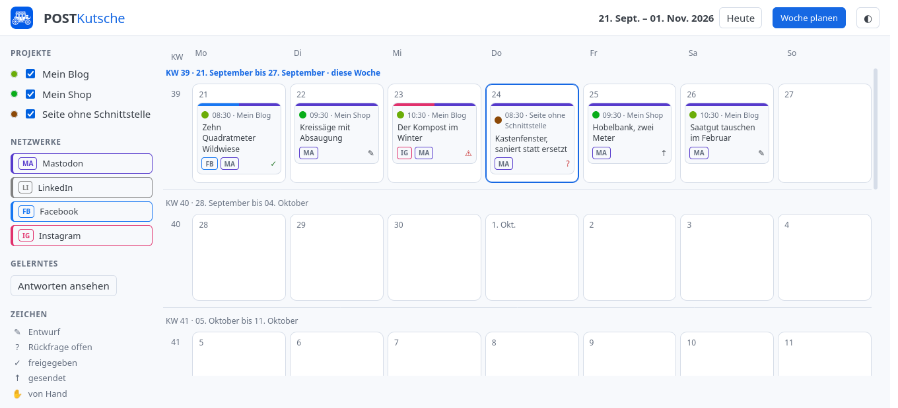
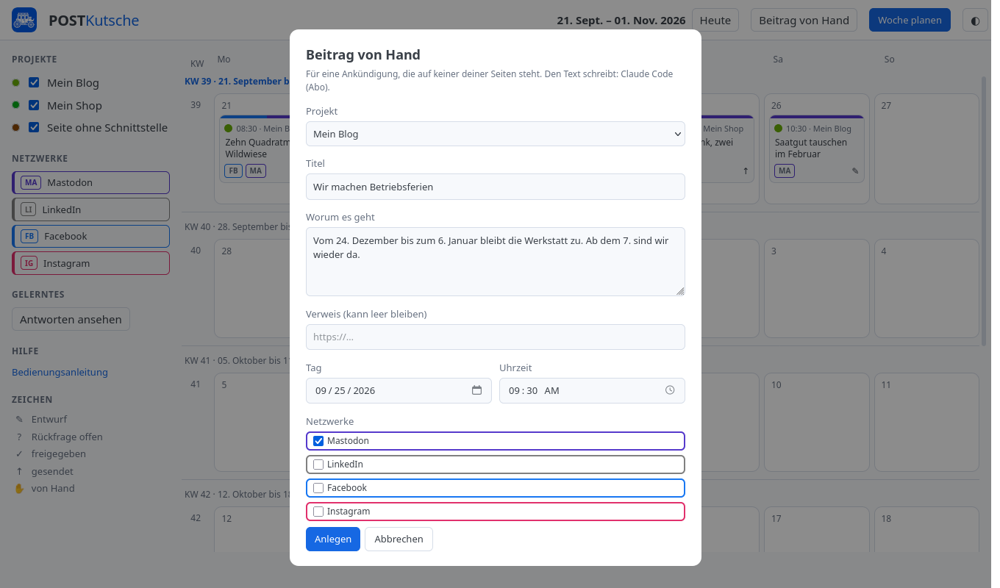
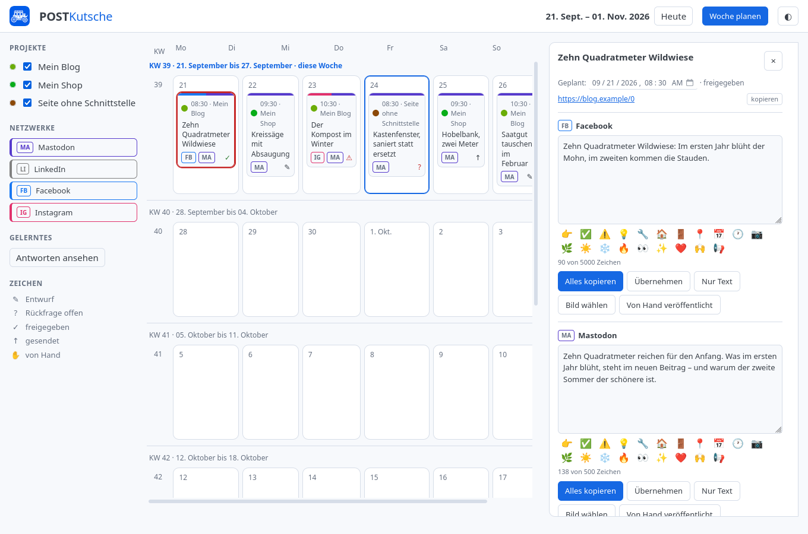
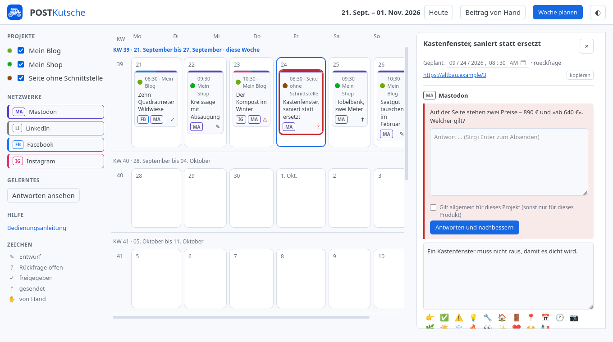
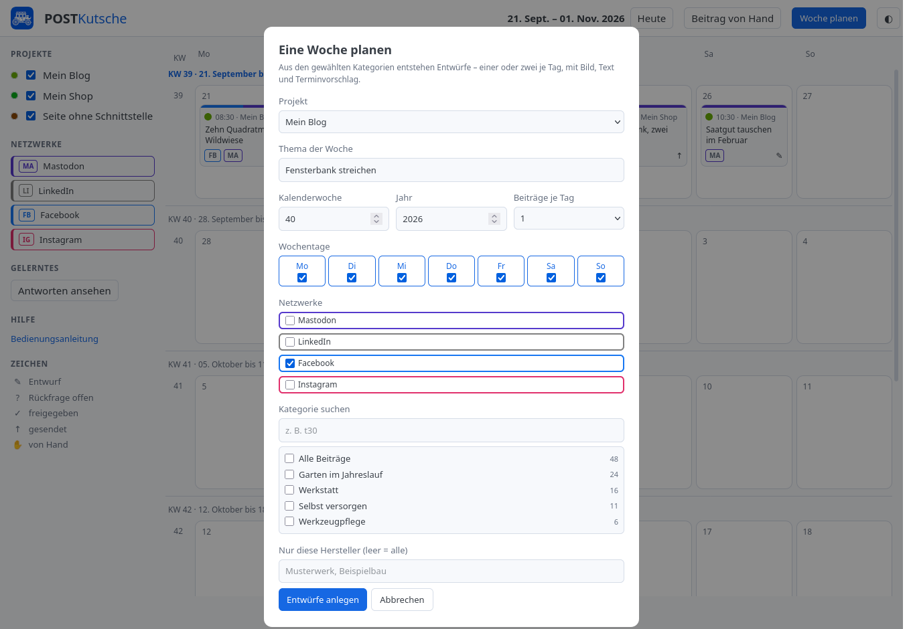
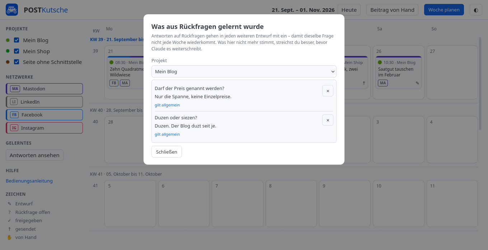

[Deutsch](bedienung.md) | [English](bedienung.en.md) | [Übersicht](../README.md) | [Installation](installation.md) | [Änderungen](../CHANGELOG.md)

# Bedienung

Wie man mit POSTKutsche arbeitet, vom Kalender bis zum veröffentlichten
Beitrag. Wie man es installiert, steht in der
[Installationsanleitung](installation.md).

Alle Bilder auf dieser Seite zeigen erfundene Projekte und erfundene Texte.
Sie entstehen mit `python werkzeuge/anleitungsbilder.py` neu, wenn sich die
Oberfläche ändert.

## Inhalt

- [Der Kalender](#der-kalender)
- [Einen Beitrag selbst anlegen](#einen-beitrag-selbst-anlegen)
- [Tipp und Produkt der Woche](#tipp-und-produkt-der-woche)
- [Wer die Texte schreibt](#wer-die-texte-schreibt)
- [Ein Beitrag im Einzelnen](#ein-beitrag-im-einzelnen)
- [Rückfragen beantworten](#rückfragen-beantworten)
- [Eine Woche planen](#eine-woche-planen)
- [Gelerntes durchsehen](#gelerntes-durchsehen)
- [Veröffentlichen](#veröffentlichen)
- [Wenn etwas klemmt](#wenn-etwas-klemmt)

## Der Kalender



Der Kalender ist die Startseite und läuft im Browser unter
`http://localhost:8770`. Er zeigt einen fortlaufenden Streifen von Wochen:
Nach oben rollen holt vergangene Wochen, nach unten kommende – nachgeladen
wird selbsttätig, ohne Blättern. **Heute** springt zurück zur laufenden
Woche. Der Knopf **◐** rechts wechselt zwischen hellem und dunklem Thema und
merkt sich die Wahl.

Jeder geplante Beitrag ist ein Kärtchen in der Farbe seines Projekts. Darin
stehen Uhrzeit, Projektname, Titel und unten die Kürzel der Netzwerke, in die
er geht – **MA** für Mastodon, **FB** für Facebook, **IG** für Instagram,
**LI** für LinkedIn. Ein Beitrag bleibt *ein* Kärtchen, auch wenn er in vier
Netzwerke geht; die Fassungen stecken darin.

Rechts unten im Kärtchen steht sein Zustand:

| Zeichen | Bedeutung |
|---|---|
| ✎ | Entwurf – geschrieben, noch nicht durchgesehen |
| ? | Rückfrage offen – Claude konnte etwas nicht entscheiden |
| ✓ | freigegeben – darf raus, ist aber noch nicht raus |
| ↑ | gesendet |
| ✋ | von Hand veröffentlicht |

**Ein Kärtchen lässt sich auf einen anderen Tag ziehen.** Die Uhrzeit bleibt
dabei stehen, nur das Datum ändert sich, und der neue Termin ist sofort
gespeichert.

In der linken Spalte stehen die Projekte mit Häkchen. Das Häkchen räumt nur
die Ansicht auf und hält nichts an – wer ein Projekt wirklich stilllegen
will, pausiert es (`postkutsche projekt pausieren …`); pausierte Projekte
stehen durchgestrichen mit einem Pausenzeichen. **Was ausgeblendet ist,
bleibt es auch nach dem Neuladen.** Gemerkt wird das im Browser, also je
Rechner und Browser; ein Projekt, das später dazukommt, ist sichtbar.

Der Farbpunkt vor dem Projektnamen ist ein Knopf: Ein Klick öffnet die
Farbwahl. Die vorgeschlagenen Farben halten Abstand zu den Netzwerkfarben,
damit man einen Projektpunkt nicht für eine Netzwerkmarke hält.

## Einen Beitrag selbst anlegen



Nicht jeder Beitrag hat eine Seite, von der er kommt. Betriebsferien, ein
Dank, ein Termin – dafür gibt es oben **Beitrag von Hand**.

Im Fenster stehen Projekt, Titel, ein paar Sätze zur Sache, ein Verweis (der
leer bleiben darf), Tag und Uhrzeit sowie die Netzwerke. Über den Feldern
steht, wer den Text schreiben wird; ist »von Hand« eingestellt, landen Titel
und deine Sätze im Entwurf und der Rest ist deine Sache.

Danach geht der Beitrag gleich auf, und du kannst den Text an Ort und Stelle
ändern. Antwortet der Dienst gerade nicht, entsteht der Beitrag trotzdem –
der Termin ist das Wichtigere, der Text lässt sich tippen.

## Tipp und Produkt der Woche

Zwei Formate, die wöchentlich erscheinen und beide mehr liefern als Text: Aus
einer einzigen Eingabe entstehen die Beitragstexte *und* eine fertige Grafik
im Hausstil, für Facebook und LinkedIn im Querformat, für Instagram im
Hochformat.

**»Produkt der Woche«** braucht nur den Verweis auf ein Produkt im Shop.
Titel, Merkmale, Foto und Preis werden von der Seite gelesen. Bis wann das
Angebot gilt, wird nicht gefragt, sondern gerechnet: Ein Angebot der Woche
läuft von Montag bis Sonntag, und in der Grafik steht der Sonntag der Woche,
in der der Beitrag erscheint.

**Der Preis kommt ausschließlich aus dem Auszeichnungsfeld der Seite**
(`itemprop="price"`), nie aus dem Fließtext. Das ist keine Pedanterie: Auf
einer echten Produktseite stand im Fließtext ein Preis von 1.329 €, der zu
einem ganz anderen Artikel aus der Empfehlungsliste daneben gehörte – das
Produkt selbst kostete 959 €. Steht kein ausgezeichneter Preis auf der Seite,
entsteht **kein** Beitrag; hier wird abgebrochen statt geraten, denn eine
Anzeige mit falschem Preis ist schlimmer als keine Anzeige. Die Ersparnis wird
aus beiden Preisen gerechnet und nicht abgeschrieben.

**»Tipp der Woche«** braucht nur ein Thema – etwa »Wie pflege ich im Herbst
Außentüren richtig?«. Daraus entstehen drei Blöcke mit je vier Ratschlägen,
ein Kasten mit Warnungen und einer mit dem, was auch ein Fachmann nicht auf
dem Schirm hat. Unter »Vorgaben« lässt sich sagen, worauf es ankommt und was
nicht hineinsoll. Ein Stimmungsbild liefert niemand mit; das Feld dafür kann
leer bleiben, dann bleibt die Fotospalte dunkel.

Beide Formate tragen dasselbe Gerüst – Logo, Fotospalte, Kastenspalte,
Kontakt an derselben Stelle. Wer sie nebeneinander sieht, erkennt denselben
Absender, bevor er ein Wort gelesen hat.

**Was dabei entsteht:** der Beitrag im Kalender, die Texte je Netzwerk, beide
Grafiken und ein Alternativtext, der wiedergibt, was im Bild steht. Den
braucht, wer einen Vorleser benutzt – ohne ihn wäre die ganze Aussage
unzugänglich, denn sie steckt im Bild.

**Der Tipp schreibt auch die Webseite fort.** Steht in `marken.json` unter
»tippseite« eine Adresse, entsteht zusätzlich eine fertige HTML-Datei: der
neue Tipp ausführlich, die Grafik der Woche anklickbar im Text, ein
hervorgehobener Merksatz, passende Artikel als Kästchen mit Bild – und der
bisherige Tipp wandert als Kachel ins Archiv der Vorwochen. Titel,
Beschreibung für Google und beide Datumsangaben werden mitgezogen.

Von den Grafiken entsteht eine verkleinerte Fassung; gezeigt wird die kleine,
ein Klick öffnet die große in einem neuen Reiter. Ohne Pillow entfällt das,
dann steht beides auf derselben Datei.

Hochgeladen wird von Hand. Nach dem Anlegen steht dabei, was wohin gehört:

```
Noch hochzuladen auf www.beispiel.example:
  Tipp-der-Woche.html → /
  2026-KW40-thema.png → /images/tipp/
  2026-KW40-thema-klein.jpg → /images/tipp/
```

**Veröffentlicht wird von Hand**, wie bei allen anderen Beiträgen auch: Text
kopieren, Bild ablegen, im Netzwerk einstellen, zurückkommen und abhaken.

Der Lauf dauert etwa eine Minute – eine Anfrage an Claude und zwei Grafiken.
Antwortet Claude nicht oder fehlt Firefox, entsteht der Beitrag trotzdem, nur
ohne Text beziehungsweise ohne Bild, und es steht dabei, woran es lag.

**Wo Logo und Rufnummer herkommen:** aus `~/.config/postkutsche/marken.json`,
nicht aus dem Programm. Dort steht je Projekt, welches Logo, welche Nummer,
welche Mailadresse und welche vier Zeilen im Kasten »Über …« erscheinen.
Mehrere Projekte können sich denselben Auftritt teilen – ein Eintrag
`{"wie": "anderekennung"}` verweist auf einen anderen, statt die Angaben zu
kopieren.

## Wer die Texte schreibt

Vier Wege gibt es, und sie lassen sich je Projekt unterscheiden:

| Weg | Wer schreibt |
|---|---|
| `kommando` | Claude Code über das vorhandene Abo – die Vorgabe |
| `offen` | ein Dienst in der OpenAI-Form: Ollama auf dem eigenen Rechner, ChatGPT, OpenRouter … |
| `anthropisch` | Claude über die Anthropic-Schnittstelle mit eigenem Schlüssel |
| `hand` | du selbst |

Eingestellt wird das auf der Kommandozeile, nicht in der Oberfläche – es ist
eine Entscheidung, die man einmal trifft:

```
postkutsche denker liste
postkutsche denker waehlen hand
postkutsche denker pruefen --projekt meinblog
```

Wie die Wege eingerichtet werden, steht in der
[Installationsanleitung](installation.md#4-festlegen-wer-die-texte-schreibt).

**Wenn er nicht antwortet, steht es oben.** Beim Start sieht POSTKutsche
nach, ob der eingestellte Weg wirklich antwortet, und schreibt das Ergebnis
auf die Konsole. Fällt er später aus – eine abgelaufene Anmeldung, ein
beendetes Ollama –, erscheint unter dem Kopf eine rote Leiste, die stehen
bleibt, bis es wieder geht. Nachgesehen wird alle paar Minuten.

Die Leiste sagt auch gleich, was zu tun ist. Der Kalender bleibt derweil
benutzbar: Ansehen, freigeben und senden geht ohne Denker, nur neue Texte
entstehen keine.

## Ein Beitrag im Einzelnen



Ein Klick aufs Kärtchen schlägt den Beitrag rechts auf. Oben stehen Termin
und Zustand – der Termin ist ein Feld und lässt sich dort ändern –, darunter
der Verweis auf die Quelle mit einem Knopf **kopieren**.

Darunter kommt je Netzwerk ein Block. Er enthält das Textfeld, eine Reihe
Emojis zum Einsetzen, die Zeichenzählung (»138 von 500 Zeichen«, rot sobald
es zu viel wird) und die Knöpfe:

- **Alles kopieren** legt Text, Verweis und Schlagwörter zusammen in die
  Zwischenablage – das, was man bei Facebook oder Instagram einfügt. Bei
  Instagram steht der Verweis nicht im Text, sondern der Hinweis, dass er im
  Profil steht; dort sind Links im Beitrag wirkungslos.
- **Nur Text** kopiert allein das Textfeld.
- **Übernehmen** speichert, was du im Feld geändert hast. Die Fassung gilt
  danach als *von Hand bearbeitet* und wird von »neu schreiben lassen« nicht
  mehr stillschweigend überschrieben – erst nach ausdrücklicher Bestätigung.
- **Bild wählen** hängt ein Bild an, **Zweites Bild** ein weiteres. Über die
  Schnittstelle geht nur das erste raus; für beide muss der Beitrag von Hand
  eingestellt werden, und die Oberfläche sagt das auch.
- **Von Hand veröffentlicht** hakt ab, was du selbst eingestellt hast.

Ist alles in Ordnung, macht **Freigeben** den Beitrag versandbereit.
Freigegeben heißt »darf raus«, nicht »ist raus«: Der Versand passiert zum
eingetragenen Termin. Solange ein Beitrag nicht erschienen ist, lässt er sich
auch **löschen**; was draußen ist, bleibt stehen.

## Rückfragen beantworten



Wenn Claude etwas nicht entscheiden konnte – zwei Preise auf der Seite, eine
Angabe, die sich widerspricht –, schreibt er keine Vermutung hin, sondern
fragt. Die Frage steht rot umrandet über dem Text, und der Beitrag lässt sich
nicht freigeben, solange sie offensteht.

Du antwortest im Feld darunter und drückst **Antworten und nachbessern**
(oder Strg+Enter). Claude schreibt den Text daraufhin neu, mit deiner
Auskunft.

Wichtig ist der Schalter **»Gilt allgemein für dieses Projekt«**:

- **Angehakt** wandert die Antwort ins Wissen des Projekts und geht in *jeden*
  weiteren Entwurf mit ein. Richtig für Dinge wie »wir duzen« oder »Preise
  nur als Spanne«.
- **Nicht angehakt** gilt sie nur für dieses eine Produkt oder diesen einen
  Beitrag.

Die Unterscheidung ist kein Beiwerk. Wer alles pauschal mitschickt, füttert
Claude nach einem halben Jahr mit dreißig Sonderfällen und bekommt schlechtere
Texte statt besserer.

## Eine Woche planen



**Woche planen** rechts oben füllt eine ganze Woche auf einmal: Für jeden
gewählten Tag sucht POSTKutsche etwas aus, das lange nicht dran war, lässt
Claude die Fassungen schreiben und legt die Entwürfe mit Terminvorschlag in
den Kalender.

Wählbar sind Blogs und Seiten ohne Schnittstelle. Die Felder im Einzelnen:

| Feld | Was es tut |
|---|---|
| **Projekt** | woher die Beiträge kommen |
| **Thema der Woche** | die Klammer, unter der die Woche steht – etwa »Fensterbank streichen« |
| **Kalenderwoche**, **Jahr** | welche Woche gefüllt wird |
| **Beiträge je Tag** | einer oder zwei |
| **Wochentage** | welche Tage belegt werden |
| **Netzwerke** | für welche Netzwerke Fassungen entstehen |
| **Bereich** | grobe Vorauswahl bei großen Shops; bei Blogs und kleinen Läden ausgeblendet |
| **Kategorie suchen** | Filter über die Liste darunter |
| **Kategorien** | woraus ausgewählt wird, mit der Zahl dessen, was darin planbar ist |
| **Nur diese Hersteller** | schränkt auf Modellreihen ein; leer heißt alle |

Die Zahl hinter einer Kategorie ist nicht immer die Zahl, die die Seite
meldet: Bei einem zweisprachigen Blog zählt WordPress die englischen
Fassungen mit, und was schon in den letzten vier Wochen dran war, ist ohnehin
gesperrt. Gezeigt wird, was tatsächlich planbar ist – sonst plant man sieben
Tage und bekommt vier Entwürfe, ohne den Grund zu erfahren.

Nach **Entwürfe anlegen** läuft es sichtbar durch: ein Balken und »3 von 10 …«
darunter. Der Knopf daneben heißt währenddessen **Planung abbrechen** und tut
genau das – der Lauf hält zwischen zwei Beiträgen an und nimmt zurück, was er
schon angelegt hat. Sonst gälten die angefangenen Inhalte vier Wochen als
beworben, obwohl nie etwas erschienen ist.

Ein zweiter Lauf ist gesperrt, solange einer läuft. Bleibt einer hängen, gibt
er nach zehn Minuten ohne Lebenszeichen von selbst frei – eine Sperre, die
niemand lösen kann, wäre schlimmer als zwei Läufe.

## Gelerntes durchsehen



**Antworten ansehen** in der linken Spalte öffnet, was aus deinen Antworten
gesammelt wurde – je Projekt, mit der Marke »gilt allgemein« oder »nur dieses
Produkt«. Das × streicht einen Eintrag.

Diese Ansicht gibt es, weil die Sammlung sonst eine Einbahnstraße wäre. Nach
einem halben Jahr steht dort etwas, das nicht mehr stimmt – ein Lieferant hat
gewechselt, eine Norm ist abgelöst –, und Claude schreibt es weiter in jeden
Beitrag, ohne dass jemand die Stelle findet.

## Veröffentlichen

Es gibt zwei Wege, und welcher gilt, hängt am Netzwerk.

**Über die Schnittstelle** geht Mastodon. Ein freigegebener Beitrag wird zum
eingetragenen Termin gesendet; darum kümmert sich der Zeitgeber, der alle
fünf Minuten nachsieht (siehe [Installation](installation.md)). War der
Rechner aus, geht der Beitrag beim nächsten Start raus – mit Hinweis auf die
Verspätung, nicht stillschweigend.

**Von Hand** gehen Facebook und Instagram. Metas App-Prüfung dauert Wochen
und muss für einen einzigen Zweck nicht sein. Der Ablauf: **Alles kopieren**,
Bild über **Unter Dokumente ablegen** holen, im Netzwerk einstellen, zurück
in POSTKutsche und **Von Hand veröffentlicht** drücken.

Abgelegte Bilder landen unter
`~/Dokumente/POSTKutsche/<Jahr>-KW<Woche>/<Projekt>/`. Sie liegen dort und
nicht im Download-Ordner, weil ein Browser nicht bestimmen kann, wohin eine
Datei geht – der Dienst läuft auf demselben Rechner und legt sie selbst hin.
Die Woche steht vorn, damit man nach ein paar Monaten weiß, was weg kann.

## Wenn etwas klemmt

**Ein Fenster geht nicht mehr zu.** Escape schließt »Woche planen« und
»Gelerntes« auch dann, wenn ein Lauf hängt.

**Die Oberfläche sieht aus wie vorher, obwohl etwas geändert wurde.** Der
Browser hält die alten Dateien fest: einmal Strg+Shift+R.

**Eine Ansicht meldet einen Fehler, der nach Schnittstelle klingt.** Die
Dateien im Browser wirken sofort, der Python-Teil erst nach einem Neustart
des Dienstes:

```
systemctl --user restart postkutsche-kalender.service
```

**Ein Beitrag lässt sich nicht freigeben.** Dann steht noch eine Rückfrage
offen – sie steht rot im Blatt.

**Der Entwurf besteht nur aus Titel und zwei Sätzen.** Dann ist »von Hand«
eingestellt, und das ist Absicht: `postkutsche denker liste` zeigt, was
gerade gilt.

**Die Kategorienliste bleibt leer oder meldet »nicht erreichbar«.** Dann
antwortet die Seite gerade nicht. Bei Shops ohne Schnittstelle wird die
Gliederung zwölf Stunden zwischengespeichert; der erste Aufruf am Morgen
dauert deshalb etwa zwanzig Sekunden, danach geht das Fenster sofort auf.
